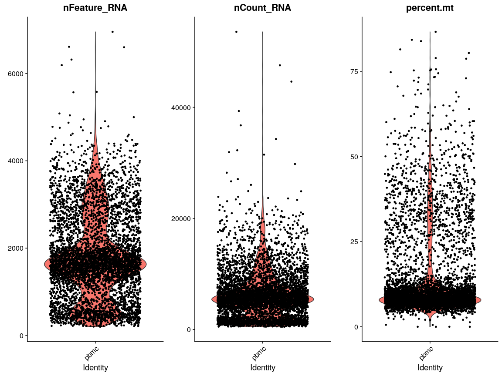
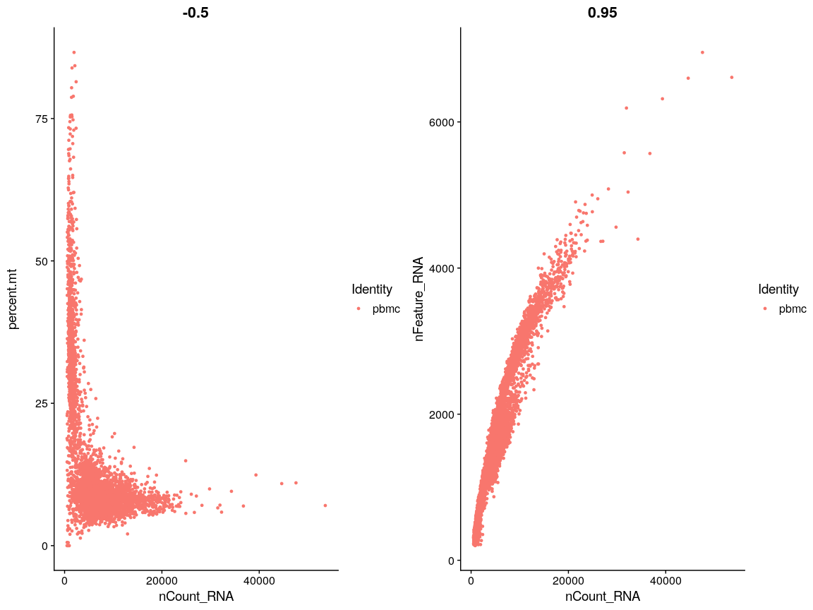
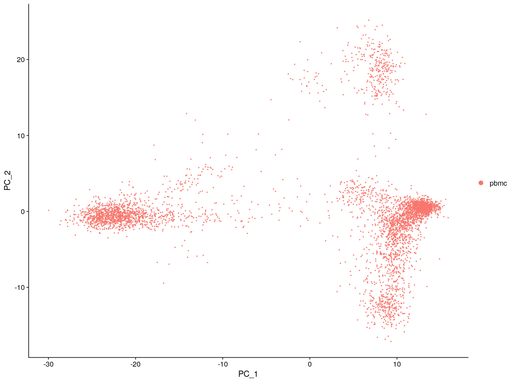
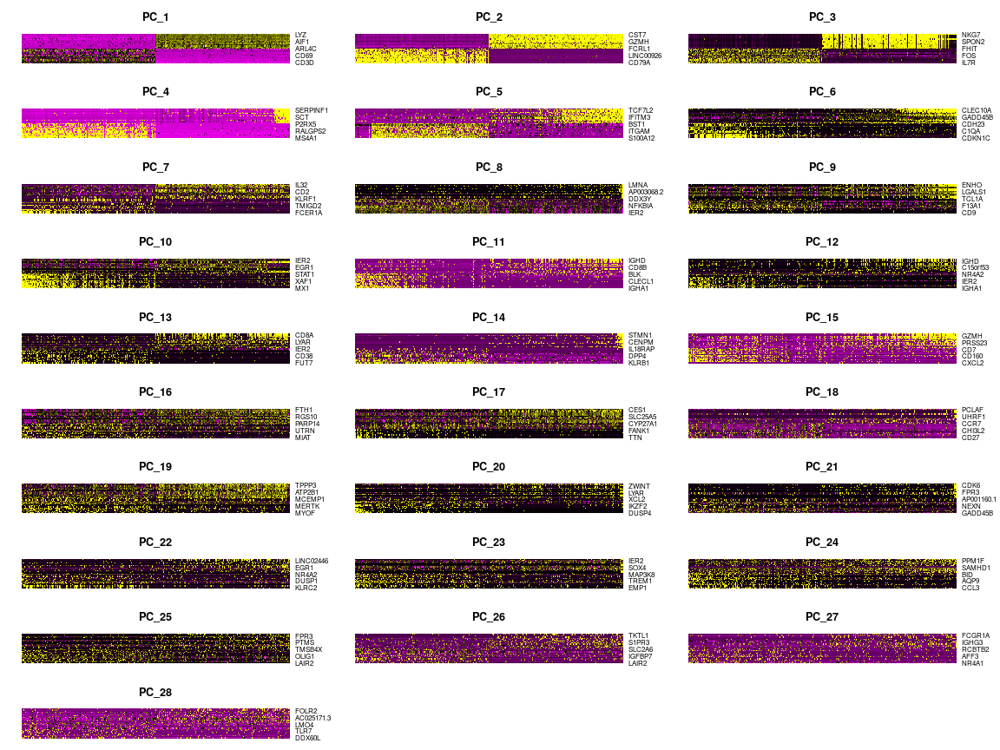
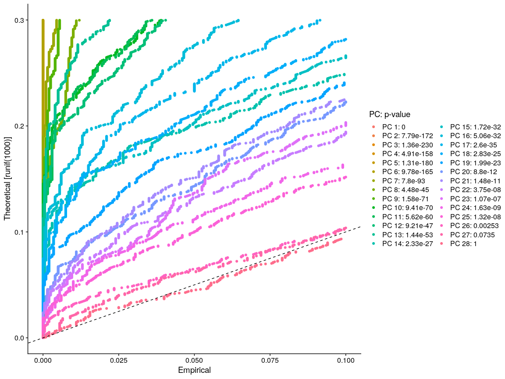
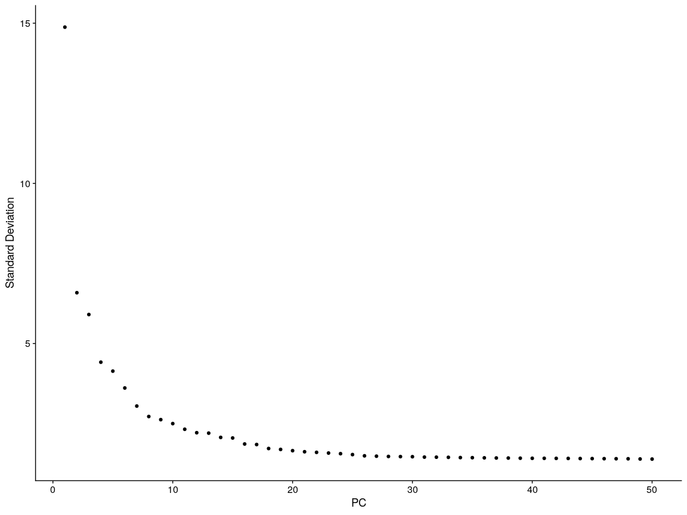
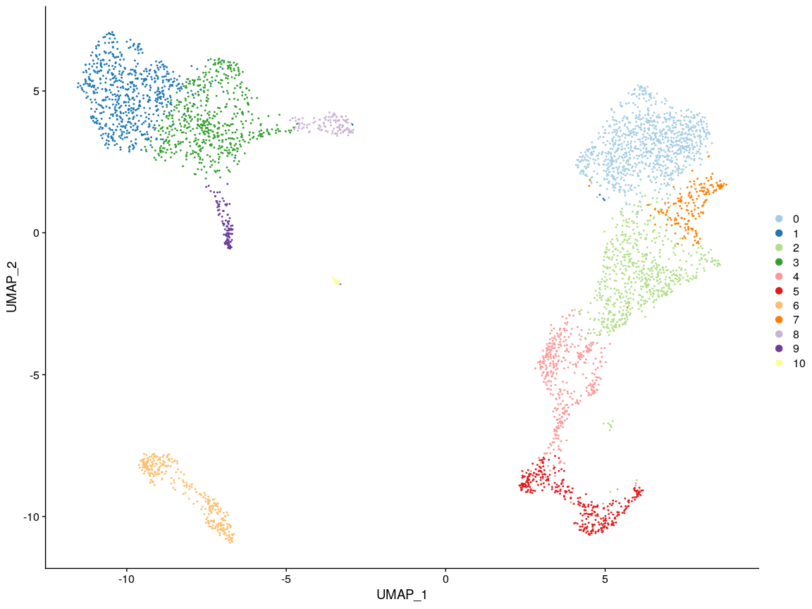
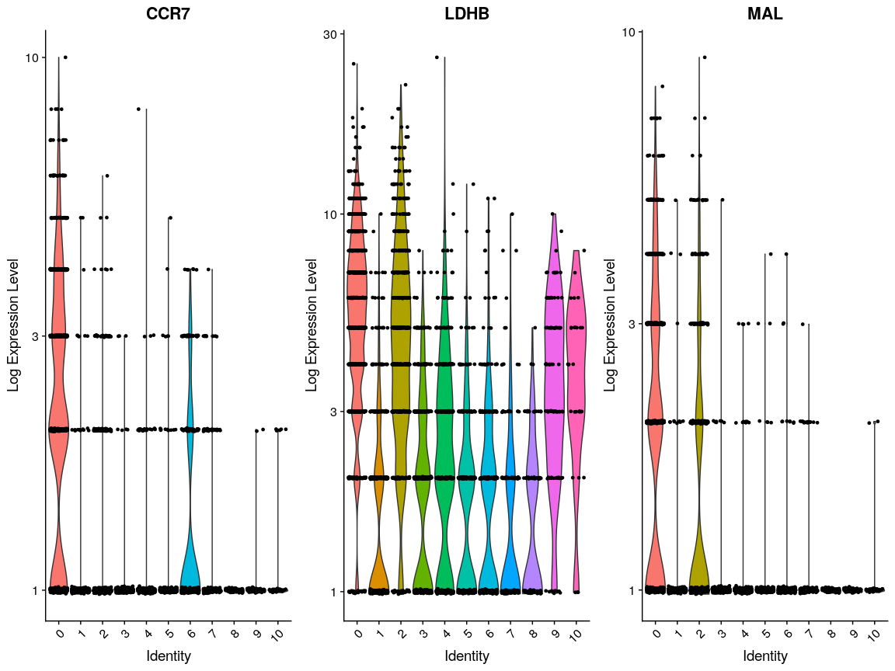
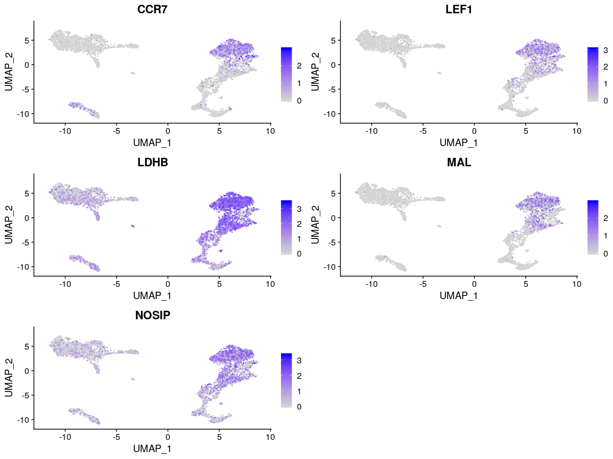
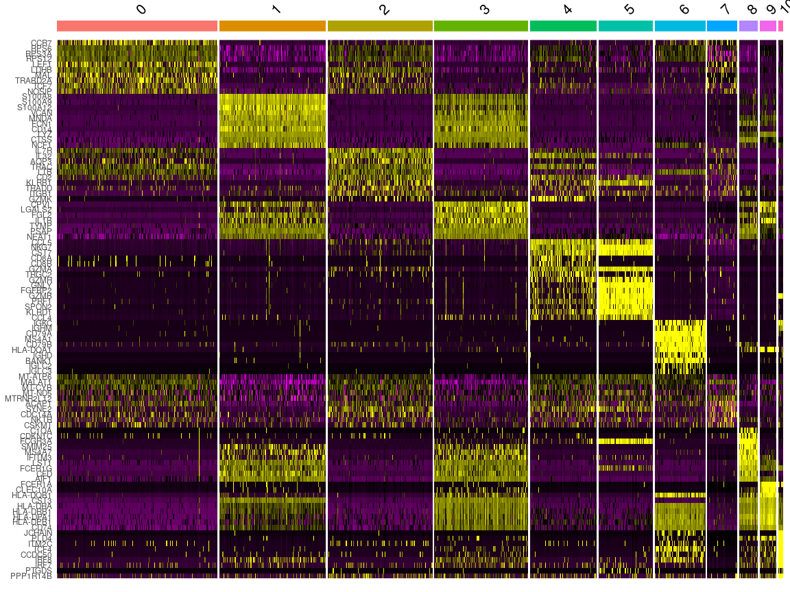

    library("edgeR")

    ## Loading required package: limma

    library("scran")

    ## Loading required package: SingleCellExperiment

    ## Loading required package: SummarizedExperiment

    ## Loading required package: GenomicRanges

    ## Loading required package: stats4

    ## Loading required package: BiocGenerics

    ## Loading required package: parallel

    ## 
    ## Attaching package: 'BiocGenerics'

    ## The following objects are masked from 'package:parallel':
    ## 
    ##     clusterApply, clusterApplyLB, clusterCall, clusterEvalQ,
    ##     clusterExport, clusterMap, parApply, parCapply, parLapply,
    ##     parLapplyLB, parRapply, parSapply, parSapplyLB

    ## The following object is masked from 'package:limma':
    ## 
    ##     plotMA

    ## The following objects are masked from 'package:stats':
    ## 
    ##     IQR, mad, sd, var, xtabs

    ## The following objects are masked from 'package:base':
    ## 
    ##     anyDuplicated, append, as.data.frame, basename, cbind,
    ##     colnames, dirname, do.call, duplicated, eval, evalq, Filter,
    ##     Find, get, grep, grepl, intersect, is.unsorted, lapply, Map,
    ##     mapply, match, mget, order, paste, pmax, pmax.int, pmin,
    ##     pmin.int, Position, rank, rbind, Reduce, rownames, sapply,
    ##     setdiff, sort, table, tapply, union, unique, unsplit, which,
    ##     which.max, which.min

    ## Loading required package: S4Vectors

    ## 
    ## Attaching package: 'S4Vectors'

    ## The following object is masked from 'package:base':
    ## 
    ##     expand.grid

    ## Loading required package: IRanges

    ## Loading required package: GenomeInfoDb

    ## Loading required package: Biobase

    ## Welcome to Bioconductor
    ## 
    ##     Vignettes contain introductory material; view with
    ##     'browseVignettes()'. To cite Bioconductor, see
    ##     'citation("Biobase")', and for packages 'citation("pkgname")'.

    ## Loading required package: DelayedArray

    ## Loading required package: matrixStats

    ## 
    ## Attaching package: 'matrixStats'

    ## The following objects are masked from 'package:Biobase':
    ## 
    ##     anyMissing, rowMedians

    ## Loading required package: BiocParallel

    ## 
    ## Attaching package: 'DelayedArray'

    ## The following objects are masked from 'package:matrixStats':
    ## 
    ##     colMaxs, colMins, colRanges, rowMaxs, rowMins, rowRanges

    ## The following objects are masked from 'package:base':
    ## 
    ##     aperm, apply, rowsum

    ## 
    ## Attaching package: 'SingleCellExperiment'

    ## The following object is masked from 'package:edgeR':
    ## 
    ##     cpm

    library("scater")

    ## Loading required package: ggplot2

    ## 
    ## Attaching package: 'scater'

    ## The following object is masked from 'package:limma':
    ## 
    ##     plotMDS

    library("Seurat")

    ## Registered S3 method overwritten by 'R.oo':
    ##   method        from       
    ##   throw.default R.methodsS3

    ## 
    ## Attaching package: 'Seurat'

    ## The following object is masked from 'package:SummarizedExperiment':
    ## 
    ##     Assays

    library("viridis")

    ## Loading required package: viridisLite

    library("here")
    library("dplyr")

    ## 
    ## Attaching package: 'dplyr'

    ## The following object is masked from 'package:matrixStats':
    ## 
    ##     count

    ## The following object is masked from 'package:Biobase':
    ## 
    ##     combine

    ## The following objects are masked from 'package:GenomicRanges':
    ## 
    ##     intersect, setdiff, union

    ## The following object is masked from 'package:GenomeInfoDb':
    ## 
    ##     intersect

    ## The following objects are masked from 'package:IRanges':
    ## 
    ##     collapse, desc, intersect, setdiff, slice, union

    ## The following objects are masked from 'package:S4Vectors':
    ## 
    ##     first, intersect, rename, setdiff, setequal, union

    ## The following objects are masked from 'package:BiocGenerics':
    ## 
    ##     combine, intersect, setdiff, union

    ## The following objects are masked from 'package:stats':
    ## 
    ##     filter, lag

    ## The following objects are masked from 'package:base':
    ## 
    ##     intersect, setdiff, setequal, union

    # https://support.10xgenomics.com/single-cell-gene-expression/datasets/3.1.0/5k_pbmc_protein_v3

    options(stringAsFactors = FALSE)

    assays <- Read10X(data.dir = here("downloads/5k_pbmc_protein_v3_filtered_feature_bc_matrix/"))

    ## 10X data contains more than one type and is being returned as a list containing matrices of each type.

    pbmc <- CreateSeuratObject(assays[["Gene Expression"]],
      project = "pbmc", 
      min.cells = 3,
      min.features = 200
    )

    pbmc[["percent.mt"]] <- PercentageFeatureSet(pbmc, pattern = "^MT-")
    VlnPlot(pbmc, features = c("nFeature_RNA", "nCount_RNA", "percent.mt"), ncol = 3)

    plot1 <- FeatureScatter(pbmc, feature1 = "nCount_RNA", feature2 = "percent.mt")
    plot2 <- FeatureScatter(pbmc, feature1 = "nCount_RNA", feature2 = "nFeature_RNA")
    CombinePlots(plots = list(plot1, plot2))

    pbmc <- subset(pbmc, subset = nFeature_RNA > 200 & nFeature_RNA < 4000 & percent.mt < 25)
    pbmc <- NormalizeData(pbmc, normalization.method = "LogNormalize", scale.factor = 10000)
    pbmc <- FindVariableFeatures(pbmc, selection.method = "vst", nfeatures = 2000)
    all.genes <- rownames(pbmc)
    pbmc <- ScaleData(pbmc, features = all.genes, vars.to.regress = c("percent.mt", "nUMI"))

    ## Regressing out percent.mt, nUMI

    ## Centering and scaling data matrix

    pbmc <- RunPCA(pbmc, features = VariableFeatures(object = pbmc))

    ## PC_ 1 
    ## Positive:  CD3D, LTB, TRAC, TRBC2, CD3G, IL32, IL7R, CD69, TRBC1, CD247 
    ##     CD2, CD7, CD27, TCF7, ARL4C, SPOCK2, HIST1H4C, BCL11B, CCR7, SYNE2 
    ##     GZMM, ITM2A, MAL, LEF1, CXCR4, OXNAD1, TRAT1, RORA, TRABD2A, BCL2 
    ## Negative:  FCN1, LYZ, CST3, MNDA, CTSS, PSAP, S100A9, FGL2, AIF1, NCF2 
    ##     GRN, LST1, CD68, CYBB, SERPINA1, TYMP, CLEC12A, VCAN, TNFAIP2, CSTA 
    ##     TYROBP, CPVL, MPEG1, S100A8, SPI1, CD14, KLF4, IGSF6, MS4A6A, CFD 
    ## PC_ 2 
    ## Positive:  CD79A, MS4A1, IGHM, BANK1, HLA-DQA1, IGKC, CD79B, LINC00926, RALGPS2, TNFRSF13C 
    ##     VPREB3, IGHD, SPIB, CD22, FCRL1, HLA-DQB1, BLK, FCRLA, FAM129C, TCL1A 
    ##     GNG7, COBLL1, PAX5, TCF4, SWAP70, CD40, ARHGAP24, P2RX5, BCL11A, CD24 
    ## Negative:  NKG7, CST7, GZMA, PRF1, KLRD1, CTSW, FGFBP2, GNLY, GZMH, CCL5 
    ##     KLRF1, GZMM, HOPX, CD247, SPON2, ADGRG1, TRDC, GZMB, MATK, FCGR3A 
    ##     CCL4, EFHD2, CLIC3, S100A4, IL2RB, KLRB1, TBX21, TTC38, PTGDR, PLEKHF1 
    ## PC_ 3 
    ## Positive:  GZMB, NKG7, GNLY, PRF1, CLIC3, KLRD1, FGFBP2, KLRF1, SPON2, CST7 
    ##     GZMH, FCGR3A, ADGRG1, GZMA, HOPX, TRDC, CTSW, PLAC8, CCL4, HLA-DPB1 
    ##     TTC38, PLEK, C12orf75, APOBEC3G, CXXC5, TBX21, CYBA, PRSS23, MATK, SYNGR1 
    ## Negative:  IL7R, TCF7, MAL, LEF1, TRABD2A, TRAC, CCR7, FOS, CD27, OXNAD1 
    ##     RGCC, LRRN3, CAMK4, LTB, FHIT, TRAT1, FOSB, RGS10, BCL11B, CD3D 
    ##     AQP3, TNFRSF25, SOCS3, CD40LG, CD3G, VIM, FLT3LG, INPP4B, SLC2A3, TSHZ2 
    ## PC_ 4 
    ## Positive:  IL3RA, SERPINF1, LILRA4, TPM2, PLD4, CLEC4C, SMPD3, GAS6, SCT, PROC 
    ##     PACSIN1, ITM2C, PTCRA, DERL3, LAMP5, DNASE1L3, KCNK17, P2RY14, MZB1, UGCG 
    ##     ASIP, PPM1J, EPHB1, LGMN, AC119428.2, MAP1A, FCER1A, LINC00996, PPP1R14B, RUNX2 
    ## Negative:  MS4A1, CD79A, LINC00926, BANK1, CD79B, TNFRSF13C, VPREB3, RALGPS2, FCRL1, IGHD 
    ##     CD22, BLK, PAX5, CD24, P2RX5, SWAP70, CD19, CD40, IGHM, FCER2 
    ##     ARHGAP24, PDLIM1, POU2AF1, TNFRSF13B, HLA-DOB, IGHG3, FCRL2, OSBPL10, IGHA1, FCRLA 
    ## PC_ 5 
    ## Positive:  S100A12, PADI4, S100A8, VNN2, CYP1B1, VCAN, CES1, ITGAM, QPCT, MCEMP1 
    ##     MGST1, RBP7, MARC1, NCF1, BST1, CLEC4E, FOLR3, MEGF9, CD14, CSF3R 
    ##     S100A9, ALOX5AP, NFE2, PADI2, TPM2, PGD, CRISPLD2, STEAP4, CKAP4, LILRA4 
    ## Negative:  C1QA, TCF7L2, CDKN1C, CTSL, BATF3, HES4, SIGLEC10, RHOC, CSF1R, IFITM3 
    ##     FCGR3A, CAMK1, MGLL, ABI3, MTSS1, RRAS, CKB, ZNF703, CXCL16, AC064805.1 
    ##     SMIM25, LY6E, HMOX1, MYOF, FMNL2, NEURL1, ADGRE2, MS4A4A, NAP1L1, SPRED1

    DimPlot(pbmc, reduction = "pca")

    DimHeatmap(pbmc, dims = 1:28, cells = 500, balanced = TRUE)

    pbmc <- JackStraw(pbmc, num.replicate = 100, dims = 50)
    pbmc <- ScoreJackStraw(pbmc, dims = 1:50)
    JackStrawPlot(pbmc, dims = 1:28)

    ## Warning: Removed 42094 rows containing missing values (geom_point).

    ElbowPlot(pbmc, ndims = 50)

    pbmc <- FindNeighbors(pbmc, dims = 1:20)

    ## Computing nearest neighbor graph

    ## Computing SNN

    pbmc <- FindClusters(pbmc, resolution = 0.5)

    ## Modularity Optimizer version 1.3.0 by Ludo Waltman and Nees Jan van Eck
    ## 
    ## Number of nodes: 4231
    ## Number of edges: 156744
    ## 
    ## Running Louvain algorithm...
    ## Maximum modularity in 10 random starts: 0.8960
    ## Number of communities: 10
    ## Elapsed time: 0 seconds

    pbmc <- RunUMAP(pbmc, dims = 1:20)

    ## Warning: The default method for RunUMAP has changed from calling Python UMAP via reticulate to the R-native UWOT using the cosine metric
    ## To use Python UMAP via reticulate, set umap.method to 'umap-learn' and metric to 'correlation'
    ## This message will be shown once per session

    ## 16:56:14 UMAP embedding parameters a = 0.9922 b = 1.112

    ## 16:56:14 Read 4231 rows and found 20 numeric columns

    ## 16:56:14 Using Annoy for neighbor search, n_neighbors = 30

    ## 16:56:14 Building Annoy index with metric = cosine, n_trees = 50

    ## 0%   10   20   30   40   50   60   70   80   90   100%

    ## [----|----|----|----|----|----|----|----|----|----|

    ## **************************************************|
    ## 16:56:14 Writing NN index file to temp file /tmp/RtmpjRIKft/file60de5e127883
    ## 16:56:14 Searching Annoy index using 1 thread, search_k = 3000
    ## 16:56:15 Annoy recall = 100%
    ## 16:56:16 Commencing smooth kNN distance calibration using 1 thread
    ## 16:56:17 Initializing from normalized Laplacian + noise
    ## 16:56:17 Commencing optimization for 500 epochs, with 178568 positive edges
    ## 16:56:26 Optimization finished

    DimPlot(pbmc, reduction = "umap", cols = "Paired")

    pbmc_markers <- FindAllMarkers(
      pbmc,
      only.pos = TRUE,
      min.pct = 0.25,
      logfc.threshold = 0.25
    )

    ## Calculating cluster 0

    ## Calculating cluster 1

    ## Calculating cluster 2

    ## Calculating cluster 3

    ## Calculating cluster 4

    ## Calculating cluster 5

    ## Calculating cluster 6

    ## Calculating cluster 7

    ## Calculating cluster 8

    ## Calculating cluster 9

    g3 <- pbmc_markers %>% 
      filter(cluster == 0) %>% 
      top_n(n = 3, wt = avg_logFC) %>%
      pull(gene)

    g5 <- pbmc_markers %>% 
      filter(cluster == 0) %>% 
      top_n(n = 5, wt = avg_logFC) %>%
      pull(gene)

    VlnPlot(pbmc, features = g3, slot = "counts", log = TRUE)

    FeaturePlot(pbmc, features = g5) + scale_color_viridis()

    top10 <- pbmc_markers %>% group_by(cluster) %>% top_n(n = 10, wt = avg_logFC)
    DoHeatmap(pbmc, features = top10$gene) + NoLegend()

    t_cells <- pbmc[, FetchData(pbmc, "ident") == 0]

    counts <- t_cells@assays$RNA@counts

    x10 <- read10X(
      path = here("downloads/5k_pbmc_protein_v3_filtered_feature_bc_matrix/")
    )

    sce <- SingleCellExperiment(
      assays = list(counts = x10$counts),
      colData = x10$samples,
      rowData = x10$genes
    )
    colnames(sce) <- gsub("-1", "", sce$Barcode)

    sce <- sce[, colnames(counts)]

    counts(sce) <- as.matrix(counts(sce))
    libsize_drop <- isOutlier(
      Matrix::colSums(counts(sce)),
      nmads = 3,
      type = "lower",
      log = TRUE
    )
    feature_drop <- isOutlier(
      Matrix::colSums(counts(sce) != 0),
      nmads = 3,
      type = "lower",
      log = TRUE
    )
    ind_expressed <- rowMeans(counts(sce) != 0) > 0.2 & 
      Matrix::rowMeans(counts(sce)) > 0.1
    ind_drop <- libsize_drop | feature_drop

    sce <- sce[ind_expressed, !ind_drop]

    pbmc <- sce
    saveRDS(pbmc, here("data/pbmc.rds"))
    # usethis::use_data(pbmc, overwrite = TRUE)
    # saveRDS(sce, "datasets/pbmc_nk_data.rds")
